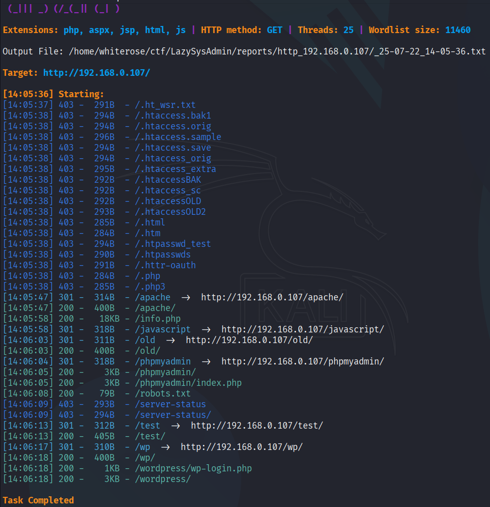
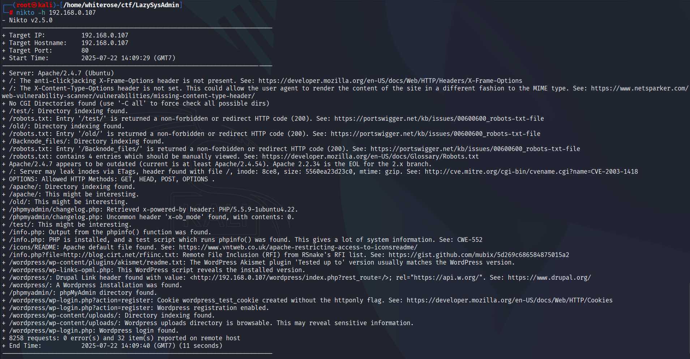

# LazySysAdmin-1
## Overview :
**[LazySysAdmin: 1](https://vulnhub.com/entry/lazysysadmin-1,205/)** is a CTF engine from **[VulnHub](https://vulnhub.com/)** designed for beginners, with a real-world approach. The system is designed to look like it's being managed by a careless sysadmin with little regard for basic security. This leaves attackers open to common mistakes like open files, leaked credentials, or weak configurations.

## Objective :
The goal of CTF **[LazySysAdmin: 1](https://vulnhub.com/entry/lazysysadmin-1,205/)** is to gain full **root** access to a Linux-based system simulated as a server owned by a **"lazy"** system administrator. Through this scenario, participants are challenged to explore configuration weaknesses, exploit security vulnerabilities, and perform privilege escalation.
- Basic enumeration of networks and services.
- Utilization of public information (open directories, config files).
- Exploiting user access to privilege escalation to root.

## The Hack :
As usual, the first thing we do is find the target IP by scanning the machines on the network we are using, using tools like **netdiscover** , **Angry IP** , etc. Here I am using **netdiscover**, so let's get started.
```
sudo netdiscover
```


The IP address 192.168.0.107 will be our target. Once we have it, let's run an **[Nmap](https://nmap.org/)** scan to check for open ports and running services.
```
nmap -sC -sV -A -p- 192.168.0.107
```


Yes, here are the results, many services are running here, as a consideration let's access the website running there and see what we get.


As usual, it looks like an empty book, next I visit **/robots.txt**, there are some entries but I don't find anything, permission is denied, so now force the directory using a tool like **"dirsearch"**.


Why **dirseacrh**? because, dirsearch is a tool for directory bruteforcing so you can download and clone this tool by using this **[link](https://github.com/maurosoria/dirsearch)**
```
dirsearch -u http://192.168.0.107
```



The **dirsearch** results revealed many hidden directories. So now I want to enumerate these directories using Nikto and look for any vulnerabilities.
```
nikto -h 192.168.0.107
```



Quite interesting... Now let's run the math with the **[whatweb](https://github.com/urbanadventurer/WhatWeb)** tool and see what we find.
```
whatweb http://192.168.0.107
```


It doesn't seem to be working. Let's move on to a tool like the **[gobuster](https://github.com/OJ/gobuster)** for more advanced enumeration.
```
gobuster dir -u 192.168.0.107 -w /usr/share/wordlists/seclists/Discovery/Web-Content/directory-list-2.3-medium.txt
```


Yeah, it's the same. Next, let's try the **[wfuzz](https://github.com/xmendez/wfuzz)** tool. Maybe we'll get something.
```
wfuzz -w /usr/share/wordlists/seclists/Discovery/Web-Content/directory-list-2.3-medium.txt http://192.168.0.107/FUZZ
```


It's still the same. I've searched on port 80, but it hasn't yielded any clues. I should try another port, like 445 or maybe 139. Let's check port 445 first, which is **[samba](https://www.samba.org/)** In this case, I'll use **[smbclient](https://www.samba.org/samba/docs/current/man-html/smbclient.1.html)** to get more information.
```
smbclient -L 192.168.0.107
```


Yappp... That's what we got, there is a **share$** directory, without further thought let's check further.
```
smbclient //192.168.0.107/share$
```


This is not bad, look there are several directories stored here, all the directories here are web directories, let's check the pages one by one.


Hmmm...I got the password on **deets.txt**, but I don't know what the username is, so let's enumerate the username.


I found the user **togie** on the **wordpress** page, and I also found the password. Since this server is running **ssh**, let's try logging in with what we found.
```
ssh togie@192.168.0.107
```


YES that's it. I successfully logged into **ssh** on port 22.
Next let's try **sudo -l** to see the permissions on SUID.
```
sudo -l
```


Here, you can see that all privileges are granted to all users. This means any user can run any command using **sudo**. Let's try it out.


I had expected it when I finally reached the top...

## Conclusion :
The LazySysAdmin CTF is a beginner-level engine designed to introduce basic techniques in enumeration and privilege escalation. This box depicts a classic scenario of a poorly managed system (lazy sysadmin), where default configurations and security oversights are exploited by an attacker to gain full access.


